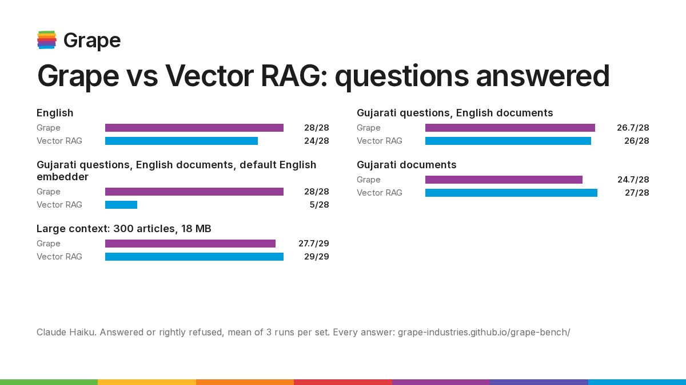

# grape-bench

<picture>
  <source media="(prefers-color-scheme: dark)" srcset="assets/benchmark-dark.png">
  
</picture>

## Results

Claude Haiku with thinking off, every suite run three times; means shown. Grape runs with its server reranker and sends 5 passages. A question counts when it is answered correctly or, if it is off-topic, refused. The full report, with every answer, is at **https://grape-industries.github.io/grape-bench/**.

| Set | Grape | Vector RAG |
|---|---|---|
| English documents, 28 questions (3 asked in Hindi, Spanish or French) | 28 / 28 | 24 / 28 (bge-small) |
| Large corpus: 300 articles, 18 MB, 29 questions | 27.7 / 29 | 29 / 29 (bge-small) |
| Gujarati documents and questions, 28 | 24.7 / 28 | 27 / 28 (e5-large) |
| Gujarati questions on the English documents, 28 | 26.7 / 28 | 26 / 28 (e5-large) |
| ...against an English embedder | 28 / 28 | 5 / 28 (bge-small) |

| Cost and speed | Grape | Vector RAG |
|---|---|---|
| Ready after a change, 12 articles | 0.1 s | 98 s |
| Ready, 18 MB (CPU) | 1.1 s | 46 min |
| Input tokens per English question | 1,217 | 1,307 |
| Cost per English question | $0.00148 | $0.00155 |
| LLM calls per English question | 1.12 | 1.00 |
| Input tokens per question, 18 MB corpus | 1,413 | 1,391 |
| Input tokens per question, Gujarati documents | 1,684 | 4,137 |
| Cost per Gujarati question on English documents | $0.00234 | $0.00199 (e5-large) |

| Retrieval alone (SQuAD 2.0 dev, 400 questions, no LLM, `tools/recall.py`) | Grape | Vector RAG |
|---|---|---|
| Right paragraph ranked first | 78.2% | 69.8% |
| Right paragraph in the top 8 | 96.5% | 96.0% |
| Ranked first after a MiniLM reranker | 90.0% | 89.5% |
| Search time per question (CPU) | 10 ms | 28 ms |

**Where Grape loses:** with 5 passages, a question whose two halves sit in different articles sometimes misses one half (Gujarati documents, 18 MB corpus). A question in another language than the documents costs one small extra LLM call to rewrite it, so it costs more than a multilingual Vector RAG. Grape's ranking was tuned on the English and Gujarati-question sets; the Gujarati-documents and large sets were only run after tuning. The question sets are small and written by us, so read one-question gaps as ties.

## Method

The same documents, the same questions, the same LLM, and two ways to find the passages it answers from:

- **Grape** ([grape-industries](https://github.com/grape-industries)): lexical search over a trigram index. The question goes straight into grape's `/search`, which picks the terms and ranks lines. Ranking uses BM25 plus signals from the file title, the lead paragraph and word proximity. For English questions the server then reranks the 20 best candidates with a small cross-encoder (ms-marco-MiniLM-L-6-v2, CPU) and returns the best 5 passages of up to 600 characters, with a `coverage` score. A clearly off-topic English question comes back `refused`, with no LLM call.
  - **Coverage ≥ 0.5:** one LLM call answers. If the passages miss the answer, that call may ask for another search in other words.
  - **Coverage < 0.5** (another language, off-topic, or a vocabulary gap): a small call sees only the file titles. It replies either `NONE` ("Not in the documents.") or `SEARCH:` with the question rewritten in the documents' language.
- **Vector RAG:** 1000-character chunks embedded locally with fastembed, and the 5 nearest chunks go to the LLM.
  - English sets use `BAAI/bge-small-en-v1.5`.
  - Gujarati sets use `intfloat/multilingual-e5-large`.

**Answers** use the same instruction for both: 1-2 sentences from the given text, in the language of the question, or "Not in the documents."

**Scoring:**
- **Keyword first:** every expected fact must appear, with Gujarati spellings listed as alternatives.
- **Judge fallback:** when no keyword matches, an LLM judge (the same model) is asked whether the answer still states the facts. A foreign name written in Gujarati has many spellings.
- **Off-topic questions** must be refused, checked by keyword only.
- **Marking:** judged answers are marked in the report. `--no-judge` turns the judge off.

**Report:** the published report, with every answer, is at **https://grape-industries.github.io/grape-bench/**. It is built from `results/*.json` by `report.py`, which is standard library only.

## Layout

```
bench.py         run one suite: Grape and Vector RAG answer the same questions -> results/
report.py        build the report (site/) from results/*.json; standard library only
questions/       the question sets, one JSON file per suite
corpus/          the documents (Wikipedia, CC BY-SA 4.0)
results/         raw results, one JSON file per run
tools/           fetch_corpus.py, fetch_squad.py, recall.py (retrieval only), gate.py, export_site.py
assets/          chart, icons and font used by the README and the report
```

## Run it

```sh
uv run tools/fetch_corpus.py fresh    # corpora are also committed in corpus/ (Wikipedia, CC BY-SA 4.0)

# a grape server: your own account on the hosted API...
export GRAPE_URL=GRAPE_URL/grape GRAPE_EMAIL=you@example.com GRAPE_PASSWORD=...
# ...or a local one (default http://localhost:8080/grape, with a local bench account)

# the published runs: the server's reranker (grape with GRAPE_RERANK_MODEL set) and 5 passages
F="--no-thinking --server-rerank --server-limit 5"
uv run bench.py --corpus fresh $F                                            # English
uv run bench.py --corpus fresh --questions questions_fresh_gu.json $F        # Gujarati questions, English docs (RAG: e5)
uv run bench.py --corpus fresh --questions questions_fresh_gu.json --embed bge-small $F  # ...with an English embedder
uv run bench.py --corpus gujarati $F                                         # Gujarati docs and questions
uv run bench.py --corpus large $F                                            # large context: 300 articles, 18 MB
uv run bench.py --corpus fresh --only grape -n 5                             # quick check: Grape only, 5 questions
python3 report.py                                                            # rebuild site/ (bench.py does this too)
```

**Cost and speed:**
- **The LLM:** `bench.py` uses your Claude Code login through `claude -p` (Haiku by default, `--model` to change). Each call runs with its own system prompt and no tools.
- **Cost figures:** tokens and cost are what the CLI reports, which is the API list price. On a subscription, the run uses plan quota instead.
- **Timing:** each `claude -p` spends about 3.5 s starting up, so compare the `api` column, which is model time only.

**Caching:** the first run per corpus embeds it on the CPU and creates the grape project. Both are cached in `cache/<corpus>/`. Each run writes `results/<corpus>-<timestamp>.json` and rebuilds `site/`.

**Other providers:** OpenAI-compatible ones work too; cost is then a reference price (`PRICE_IN` / `PRICE_OUT` in `bench.py`).

```sh
NVIDIA_API_KEY=nvapi-... uv run bench.py --provider nvidia
CF_ACCOUNT_ID=... CF_API_TOKEN=... uv run bench.py --provider cloudflare
```

**Also here:**
- `tools/recall.py`: retrieval recall on SQuAD 2.0 with no LLM. Run `tools/fetch_squad.py` first.
- `tools/gate.py`: calibrates the off-topic gate thresholds (the server uses them; `--gate` runs the same gate in the client).
- `--server-rerank` / `--server-limit N`: Grape's own reranker and gate on the server, N passages (default 6).
- `--rerank`: a client-side cross-encoder over the top 20 candidates, for both Grape and Vector RAG.

## Publishing

The GitHub Pages workflow (`.github/workflows/pages.yml`) rebuilds the report on every push that changes `results/`.
